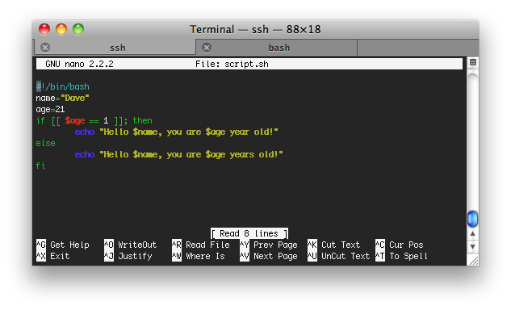

Bash has conditional statements just like any other programming language, and
the most common is the `if` command. To see this work we're going to edit the
script we made earlier to do a little check first.  If you recall the script,
it will always print '$age years old', but what if age is 1? You wouldn't say
'1 years old'.  To fix this we will use an if statement.  Do `nano script.sh`

Now the script will check to see if the user is 1, and if he or she is, print
'year' instead of 'years'.
