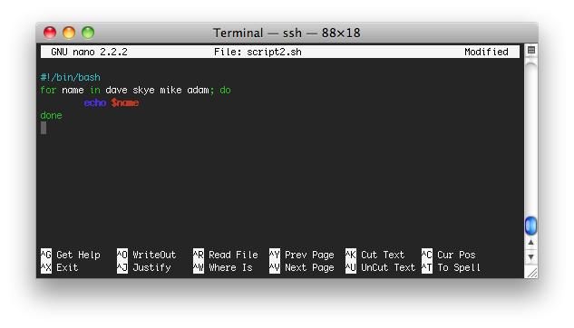

Bash has really unique for loops, as they allow you to dynamically create a
list with no specific syntax.  For example, this script will yield this
output.

The output

    dave
    skye
    mike
    adam

This is a really handy way to iterate through a list of names or a list of
anything.
