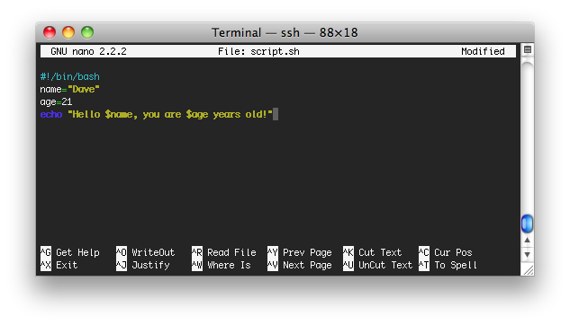

A script is a collection of commands saved in a file that can be called upon
later.  To write a script is very easy, and we will use nano to write one.  Nano
is a super light weight text editor that is easy to use and learn.
To start off go to your home directory by typing `cd ~` (bonus, you can also do
`cd "$HOME"`, or just `cd` by itself)!  Now type this command.

    nano script.sh

This will open up a text editor for this newly created file.  Now type this in
exactly as it appears

To save press CTRL + x, then y for yes, then enter.  This will save the file.
Now to call the script type `bash script.sh`. The output should look like
this...

    dave@[datadyne]:~/$ bash script.sh
    Hello Dave, you are 21 years old!

It used the variables and replaced them where they belonged in the `echo` statement.

That was a basic script, we'll cover more advanced ones later.

Note. Nano as an editor is pretty basic, for more advanced text editing you might want
to consider an editor like vim.
