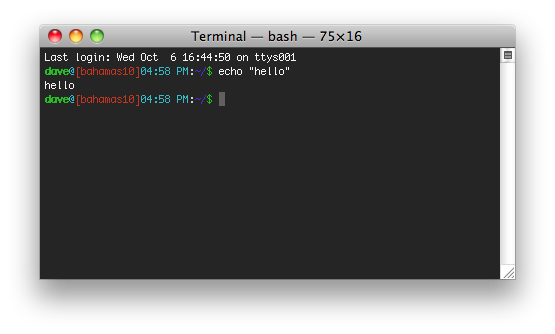

Terminal is what allows us to interface with the computer.  When you open a
terminal program on Mac or Linux however you are actually opening a terminal
emulator.  The reason for this is that you are opening a terminal window, in a
window system.  This program is emulating a terminal for you to work on inside
a nice GUI.

This is an example of a terminal emulator running on a mac

